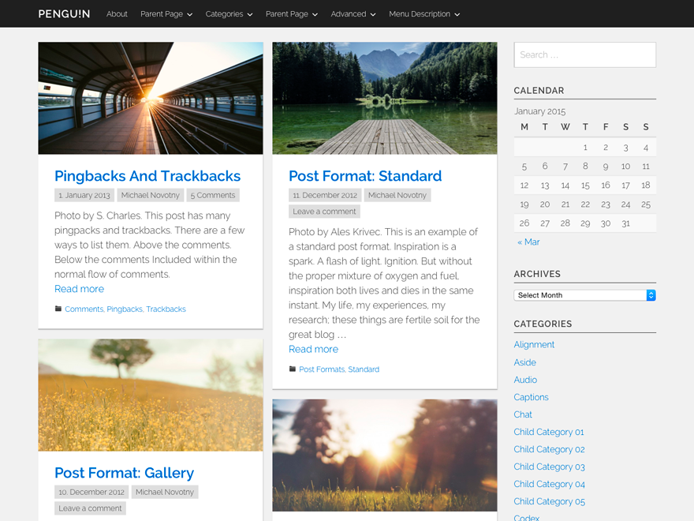

# PENGU!N

*Beta Status*

## WordPress Theme by WPZOO
PENGU!N is a clean and modern WordPress theme made by [WPZOO](http://wpzoo.ch/). Besides the link color, it consists of clean shades of grays. The post thumbnail will be used as a big header image on single posts as well as pages. PENGU!N theme can be used as blogging as well as a magazin theme.

Moreover PENGU!N is a responsive, mobile first theme. That means reading your website on mobile device will be as on a desktop computer.

### Documentation & Support
If you have any question using this theme, please visit our documentation page. If your issue will still be there after reading our documentation, please ask your question in our forum.

When you're coming across a theme bug – please contact us directly with the help of our bug form.

As a Gold user we will provide you with private email support. However you need to contact us via the contact form on our member site.

### License
This theme is licensed under the GNU General Public License version 3. All ressources which have been included are provided with the same or a compatible license. Read more in [license.txt](/license.txt).

## Credits
Thanks a lot to all people who are involved in the following projects.

### Translations
PENGU!N has been translated into the following languages so far:
- German by Stefan Brechbühl

If you are a multilangual and wanna help us make PENGU!N even more international, join us on [webtranslateit.com](https://webtranslateit.com/en/projects/9863-PENGU-N).

### Starting point
PENGU!N is based on the well known and maintained [starter theme _s](https://github.com/Automattic/_s) (underscores).

### Font / icon font
PENGU!N's typeface is the elegant sans-serif font [Raleway](http://www.google.com/fonts/specimen/Raleway), hosted on Google and shared with the SIL Open Font License.

The icon font used in PENGU!N only contains the icons which are really needed. These icons coming from the [ionicons](http://ionicons.com/) font which have designed by [@benjsperry](https://twitter.com/benjsperry) and licensed under MIT.

### Masonry
The multi column layout which appears on a bigger screen has implemented with the help of [Masonry](http://masonry.desandro.com/), a JavaScript grid layout library. Masonry is available under the MIT license.

### Customizer Library
This is a helpful library for working with the influded WordPress Theme customizer. [Customizer Library](https://github.com/devinsays/customizer-library) is shared by Devin Price on github.

### Fluidvids
[Fluidvids](https://github.com/toddmotto/fluidvids) is a JavaScript library and helps PENGU!N to show your embed videos in a responsive way. Fluidvids is available under the MIT license.
